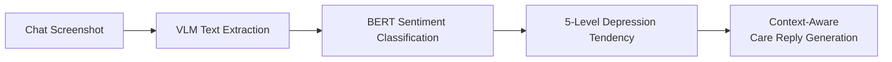

<a name="readme-top"></a>

<div align="center">

<h1>AutoReply · Smart Reply Assistant</h1>

<p><strong>AI that understands conversation emotions and replies like a real person — see the screen, detect sentiment, reply intelligently, accumulate experience.</strong></p>

<p>
  <a href="./README.md"><b>简体中文</b></a>
  &nbsp;·&nbsp;
  <a href="./README.en.md">English</a>
</p>

<p>
  <a href="LICENSE"></a>
  
  
  
</p>

<p>
  <a href="#-overview"><b>Overview</b></a> ·
  <a href="#-key-features"><b>Features</b></a> ·
  <a href="#-advantages-over-original-project"><b>Advantages</b></a> ·
  <a href="#-quick-start"><b>Quick Start</b></a> ·
  <a href="#-configuration"><b>Configuration</b></a> ·
  <a href="#-architecture"><b>Architecture</b></a>
</p>

</div>

---

## 📌 Overview

**AutoReply (Smart Reply Assistant)** is a VLM-powered desktop intelligent auto-reply system focused on instant messaging scenarios. The system automatically monitors chat windows, understands conversation content and emotional states, generates personalized replies, and accumulates reusable dialogue experience from every interaction.

Built on the [SightFlow](https://github.com/sightflow-dev/sightflow-desktop-agent) open-source project with deep secondary development, it retains the original vision-driven automation capabilities while adding **BERT sentiment classification, multi-mode management, specific contact routing, semi-auto reply, and working memory engine** — upgrading the project from a general-purpose RPA tool to a conversation-focused intelligent reply platform.

---

## ✦ Key Features

### 🎯 Intelligent Conversation Reply

| Capability | Description |
| :-- | :-- |
| **Vision-Driven** | VLM automatically identifies chat window layout and extracts message content — no API integration needed |
| **Sentiment-Aware** | Built-in BERT sentiment classification module with 5-level depression tendency detection and automatic care strategy injection |
| **Semi-Auto Reply** | AI recommends reply → user one-click paste/reply/skip — human-AI collaboration for safety |
| **Full Automation** | Three-level auto-reply switches (global / mode / contact) — unattended operation supported |

### 🧠 Multi-Mode Management

| Capability | Description |
| :-- | :-- |
| **Preset Modes** | Depression prediction, romance, high EQ — built-in system modes, can be disabled but not deleted |
| **Custom Modes** | Create modes freely with custom Prompt, sentiment analysis toggle, unified prefix |
| **Independent Runtime** | Each mode has its own running state, log stream, and recommended reply |
| **Parallel Execution** | Multiple modes can run simultaneously, each maintaining its own conversation detection loop |

### 👤 Specific Contact Routing

| Capability | Description |
| :-- | :-- |
| **Contact Identification** | VLM automatically extracts contact name from chat window title bar |
| **Smart Routing** | Matched contact → route to dedicated mode; unmatched → use global default mode |
| **Personalized Config** | Each contact can have specific title, relationship description, and independent auto-reply strategy |
| **Prompt Injection** | Contact's title and relationship are automatically injected into the Prompt for context-aware replies |

### 💛 BERT Sentiment Classification



| Level | Category | Care Strategy |
| :-- | :-- | :-- |
| 0 | No depression | Normal conversation reply |
| 1 | Mild depression | Gentle care, encourage expression |
| 2 | Moderate depression | Active listening, emotional support |
| 3 | Severe depression | Deep empathy, suggest professional help |
| 4 | Extreme depression | Strongly recommend medical attention, provide hotline info |

### 📚 Working Memory Engine

AutoReply's most differentiated capability — letting AI **learn and accumulate experience** from every conversation:

| Layer | Capability | Description |
| :-- | :-- | :-- |
| **L1 Record** | Structured Traces | Each step records: timestamp / UI state / rationale / action / result |
| **L2 Replay** | Trace Playback | Timeline card flow + step-by-step replay + screenshot highlighting for decision review |
| **L3 Inherit** | Experience Accumulation | Traces auto-inducted into experience cards, injected into Prompt at runtime, with quantifiable effectiveness stats |

> Others record **operation steps**; we record **"why this decision was made"**. The key difference from RPA to Agent Runtime.

### 🖥️ Multi-Provider Model Support

| Provider | Default Model | Capabilities |
| :-- | :-- | :-- |
| Volcengine Ark | doubao-seed-2-0-lite-260215 | Text + Vision |
| DashScope (Alibaba Cloud) | qwen-vl-plus | Text + Vision |
| OpenAI | gpt-4o | Text + Vision |
| DeepSeek | deepseek-chat | Text |
| Custom | - | Text |

- **Vision model** and **reply model** configured separately for flexible combination
- Model capability tags (text/vision/audio) with connection testing
- Non-vision reply models automatically enable text extraction mode
- Click anywhere on model card to open editor, one-click connection test button

### 📱 Multi-Platform IM Support

| Application | Detection Method |
| :-- | :-- |
| WeChat / WeCom | VLM automatic window layout detection |
| DingTalk / Lark / Slack / Telegram | Manual region selection |
| Other desktop apps | Manual region selection |

---

## ✦ Advantages Over Original Project

| Dimension | SightFlow (Original) | AutoReply (This Project) |
| :-- | :-- | :-- |
| **Positioning** | General desktop RPA tool | Conversation-focused intelligent reply platform |
| **Sentiment Understanding** | None | ✅ BERT 5-level sentiment classification + automatic care strategies |
| **Reply Modes** | Single global mode | ✅ Multi-mode management + custom Prompt + independent runtime |
| **Contact Recognition** | None | ✅ VLM contact identification + specific contact routing + personalized config |
| **Reply Method** | Full-auto only | ✅ Semi-auto (recommend/paste/reply/skip) + full-auto, three-level auto-reply priority |
| **Experience Accumulation** | Work trace recording | ✅ Trace recording + playback + experience accumulation + runtime injection + quantifiable effectiveness |
| **Model Configuration** | Fixed Volcengine Ark | ✅ Multi-provider support + vision/reply model separation + capability tags |
| **Standby Management** | None | ✅ Progressive backoff standby + semantic confirmation exit + status visualization |
| **Model Training** | None | ✅ Built-in training UI + Kaggle dataset + real-time progress streaming |
| **Human Correction** | None | ✅ Trace step correction → accumulated as experience cards |

---

## 🚀 Quick Start

### Prerequisites

- **Node.js** (LTS version)
- **Python 3.8+** (required for sentiment classification module)
- **npm**

### 1. Install Dependencies

```bash
git clone https://github.com/DreDabe/auto-reply.git
cd auto-reply

npm install
```

### 2. Python Dependencies

On first run, the program will **automatically detect and install** Python dependencies (`torch`, `transformers`, `pandas`, `scikit-learn`, `kagglehub`, `tqdm`, `numpy`).

For manual installation:

```bash
pip install -r sentpredict/requirements.txt
```

> For users in China, HuggingFace mirror is recommended: the program has built-in `HF_ENDPOINT=https://hf-mirror.com`.

### 3. Run in Development Mode

```bash
npm run dev
```

### 4. Build for Production

```bash
npm run build:win     # Windows
npm run build:mac     # macOS
npm run build:linux   # Linux
```

---

## ⚙️ Configuration

### Basic Setup

1. Go to [Volcengine Console → Ark](https://console.volcengine.com/ark), enable the service and generate an API Key
2. Launch the app and click the settings button at the bottom of the sidebar
3. In **Basic Configuration**, select global vision model and global reply model
4. In **Agent**, select the active Provider — built-in default is **Doubao Seed**

### Model Configuration

Manage AI models from different providers in the **Model Configuration** section of settings:

- Click **+ Add Model** to select a provider and enter API Key
- Connection testing supported to verify configuration
- Model capabilities auto-tagged — vision models for layout detection, text models for reply generation

### Sentiment Model Training

Operate in the **Model Training** section of settings:

1. Click **Start Training** — automatically downloads dataset and starts training
2. Training logs display in real-time in the log view below
3. After training, the model is automatically saved as `sentpredict/models/best.pt`

> ⚠️ Training takes a long time (hours). First-time training requires downloading BERT pre-trained weights and dataset.

### Target App & Region Selection

- **WeChat / WeCom**: VLM automatic window region detection by default
- **DingTalk, Lark, Slack, Telegram, etc.**: Manual selection of three regions (contact list, chat content area, input box)

---

## 🏗️ Architecture

```
src/
├── main/
│   ├── index.ts              # Main process: window management, IPC, engine orchestration
│   ├── overlay-window.ts     # Box-select wizard window
│   ├── provider-bundle.ts    # Provider installation and loading
│   └── skill-server.ts       # Local HTTP API
├── core/
│   ├── ai-client.ts          # Unified AI call wrapper
│   ├── device.ts             # Device interface
│   ├── rpa-device.ts         # VLM layout detection + RPA operations
│   ├── box-select-device.ts  # Manual box-select mode
│   ├── runtime-host.ts       # Event queue + trace + memory
│   ├── generic-channel-session.ts  # State machine + mode routing
│   ├── sentiment/
│   │   └── classifier.ts     # BERT sentiment classifier (Python subprocess)
│   ├── memory/
│   │   ├── experience-store.ts  # Experience card storage
│   │   └── learn-from-session.ts  # Trace → experience induction
│   ├── trace/
│   │   └── trace-recorder.ts # Structured work traces
│   ├── rpa/
│   │   ├── vision-utils.ts   # VLM vision detection
│   │   ├── image-compare.ts  # Pixel diff detection
│   │   ├── has-unread.ts     # Unread badge detection
│   │   ├── input-utils.ts    # RPA input operations
│   │   └── screenshot-utils.ts  # Screenshot utilities
│   └── types.ts              # Global type definitions
├── preload/
│   └── index.ts              # Preload script (IPC Bridge)
└── renderer/
    └── src/
        ├── App.tsx           # Main UI + Settings + Mode management
        ├── MemoryWindow.tsx  # Working memory window
        ├── i18n.ts           # Internationalization
        └── index.css         # Global styles
```

---

## 🔐 Security & Data

- Work traces and experience cards are **stored locally by default** — never uploaded to any server
- Sentiment classification runs in a local Python subprocess — text data never leaves your machine
- API Keys stored locally via electron-store with encryption
- Skill HTTP Server only listens on `127.0.0.1:12680`
- **Your work data always belongs to you**

---

## 💬 Questions & Contact

For questions, suggestions, or feedback, feel free to reach out:

- 📧 Email: [dreadabe@gmail.com](mailto:dreadabe@gmail.com)

---

## 🤝 Acknowledgements

This project is built on the following open-source project:

- **[SightFlow](https://github.com/sightflow-dev/sightflow-desktop-agent)** — Open-source desktop AI working memory engine, Apache License 2.0

---

## 📄 License

Released under the [Apache License 2.0](LICENSE).

---

<div align="center"><sub>© 2026 AutoReply. Based on SightFlow. Released under the Apache License 2.0.</sub></div>

<p align="right"><a href="#readme-top">↑ Back to top</a></p>
