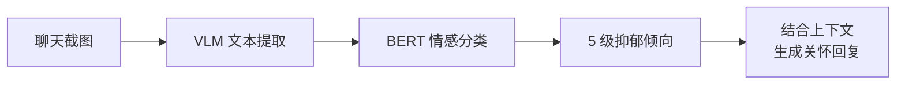

<a name="readme-top"></a>

<div align="center">

<h1>AutoReply · 智能回复助手</h1>

<p><strong>让 AI 理解对话情感，像真人一样回复消息 —— 看懂界面、识别情绪、智能回复、沉淀经验。</strong></p>

<p>
  <a href="./README.en.md">English</a>
  &nbsp;·&nbsp;
  <a href="./README.md"><b>简体中文</b></a>
</p>

<p>
  <a href="LICENSE"></a>
  
  
  
</p>

<p>
  <a href="#-项目概述"><b>项目概述</b></a> ·
  <a href="#-核心功能"><b>核心功能</b></a> ·
  <a href="#-相较于原项目的优势"><b>优势对比</b></a> ·
  <a href="#-快速开始"><b>快速开始</b></a> ·
  <a href="#-配置说明"><b>配置说明</b></a> ·
  <a href="#-架构概览"><b>架构概览</b></a>
</p>

</div>

---

## 📌 项目概述

**AutoReply（智能回复助手）** 是一款基于视觉语言模型 (VLM) 的桌面端智能自动回复系统，专注于即时通讯场景。系统能够自动监控聊天窗口、理解对话内容与情感状态、生成个性化回复，并从每一次交互中沉淀可复用的对话经验。

基于 [SightFlow](https://github.com/sightflow-dev/sightflow-desktop-agent) 开源项目深度二次开发，在保留原有视觉驱动自动化能力的基础上，新增了 **BERT 情感分类、多模式管理、特定对象路由、半自动回复、工作记忆引擎** 等核心功能，将项目从一个通用 RPA 工具升级为专注对话场景的智能回复平台。

---

## ✦ 核心功能

### 🎯 智能对话回复

| 能力 | 说明 |
| :-- | :-- |
| **视觉驱动** | 通过 VLM 自动识别聊天窗口布局，提取消息内容，无需任何 API 接入 |
| **情感感知** | 内置 BERT 情感分类模块，5 级抑郁倾向识别，自动注入关怀策略 |
| **半自动回复** | AI 推荐回复 → 用户一键粘贴/回复/跳过，人机协作更安全 |
| **全自动化** | 支持全局/模式/对象三级自动回复开关，无人值守也可运行 |

### 🧠 多模式管理

| 能力 | 说明 |
| :-- | :-- |
| **预设模式** | 抑郁预测、恋爱、高情商 — 内置系统模式，可禁用不可删除 |
| **自定义模式** | 自由创建模式，配置专属 Prompt、情感分析开关、统一开头 |
| **独立运行** | 每个模式拥有独立的运行状态、日志流和推荐回复 |
| **并行运行** | 多模式可同时运行，各自维护独立的对话检测循环 |

### 👤 特定对象路由

| 能力 | 说明 |
| :-- | :-- |
| **对象识别** | VLM 从聊天窗口标题栏自动提取对话对象名称 |
| **智能路由** | 匹配特定对象 → 路由到专属模式；未匹配 → 使用全局默认模式 |
| **个性化配置** | 每个对象可设置特定称呼、关系描述、独立自动回复策略 |
| **Prompt 注入** | 对象的称呼和关系自动注入 Prompt，让回复更贴合语境 |

### 💛 BERT 情感分类



| 等级 | 类别 | 关怀策略 |
| :-- | :-- | :-- |
| 0 | 无抑郁 | 正常对话回复 |
| 1 | 轻度抑郁 | 温和关怀，鼓励表达 |
| 2 | 中度抑郁 | 主动倾听，提供情感支持 |
| 3 | 重度抑郁 | 深度共情，建议寻求专业帮助 |
| 4 | 极重度抑郁 | 强烈建议就医，提供心理热线信息 |

### 📚 工作记忆引擎

这是 AutoReply 最具差异化的能力 —— 让 AI 从每次对话中**学习和积累经验**：

| 层级 | 能力 | 说明 |
| :-- | :-- | :-- |
| **L1 记录** | 结构化轨迹 | 每步操作记录：时间戳 / 界面状态 / 判断依据 / 动作 / 结果 |
| **L2 回放** | 轨迹回放 | 时间轴卡片流 + 逐步回放 + 截图高亮，可复盘每一步决策 |
| **L3 继承** | 经验沉淀 | 轨迹自动归纳为经验卡片，运行时注入 Prompt，效果可量化统计 |

> 别人记录的是**操作步骤**，我们记录的是**「为什么这么做」**。从 RPA 到 Agent Runtime 的关键差别。

### 🖥️ 多供应商模型支持

| 供应商 | 默认模型 | 能力 |
| :-- | :-- | :-- |
| 火山方舟 (Volcengine Ark) | doubao-seed-2-0-lite-260215 | 文本 + 视觉 |
| 阿里云百炼 (DashScope) | qwen-vl-plus | 文本 + 视觉 |
| OpenAI | gpt-4o | 文本 + 视觉 |
| DeepSeek | deepseek-chat | 文本 |
| 自定义 | - | 文本 |

- **视觉模型**与**回复模型**分离配置，灵活组合
- 模型能力标记（text/vision/audio），连接测试功能
- 不支持视觉的回复模型自动启用文本提取模式
- 点击模型卡片任意位置即可打开编辑，测试连接按钮一键验证

### 📱 多平台即时通讯支持

| 应用 | 检测方式 |
| :-- | :-- |
| 微信 / 企业微信 | VLM 自动检测窗口布局 |
| 钉钉 / 飞书 / Slack / Telegram | 手动框选区域 |
| 其他桌面应用 | 手动框选区域 |

---

## ✦ 相较于原项目的优势

| 维度 | SightFlow（原项目） | AutoReply（本项目） |
| :-- | :-- | :-- |
| **定位** | 通用桌面 RPA 工具 | 专注对话场景的智能回复平台 |
| **情感理解** | 无 | ✅ BERT 5 级情感分类 + 自动关怀策略 |
| **回复模式** | 单一全局模式 | ✅ 多模式管理 + 自定义 Prompt + 独立运行 |
| **对象识别** | 无 | ✅ VLM 对象识别 + 特定对象路由 + 个性化配置 |
| **回复方式** | 仅全自动 | ✅ 半自动（推荐/粘贴/回复/跳过）+ 全自动，三级自动回复优先级 |
| **经验积累** | 工作轨迹记录 | ✅ 轨迹记录 + 回放 + 经验沉淀 + 运行时注入 + 效果量化 |
| **模型配置** | 固定火山方舟 | ✅ 多供应商支持 + 视觉/回复模型分离 + 能力标记 |
| **待机管理** | 无 | ✅ 渐进式退避待机 + 语义确认退出 + 状态可视化 |
| **模型训练** | 无 | ✅ 内置训练界面 + Kaggle 数据集 + 实时进度推送 |
| **人工纠正** | 无 | ✅ 轨迹步骤纠正 → 沉淀为经验卡片 |

---

## 🚀 快速开始

### 前置条件

- **Node.js** (LTS 版本)
- **Python 3.8+**（情感分类模块需要）
- **npm**

### 1. 安装依赖

```bash
git clone https://github.com/DreDabe/auto-reply.git
cd auto-reply

npm install
```

### 2. Python 依赖

首次运行时，程序会**自动检测并安装** Python 依赖（`torch`, `transformers`, `pandas`, `scikit-learn`, `kagglehub`, `tqdm`, `numpy`）。

如需手动安装：

```bash
pip install -r sentpredict/requirements.txt
```

> 国内用户建议配置 HuggingFace 镜像：程序已内置 `HF_ENDPOINT=https://hf-mirror.com`。

### 3. 运行开发模式

```bash
npm run dev
```

### 4. 构建发布

```bash
npm run build:win     # Windows
npm run build:mac     # macOS
npm run build:linux   # Linux
```

---

## ⚙️ 配置说明

### 基础配置

1. 打开 [火山引擎控制台 → 方舟](https://console.volcengine.com/ark)，启用服务并生成 API Key
2. 启动应用后点击侧边栏底部设置按钮
3. 在 **基础配置** 中选择全局视觉模型和全局回复模型
4. 在 **智能体** 中选择启用的 Provider，内置默认为 **豆包 Seed**

### 模型配置

在设置界面的 **模型配置** 中管理不同供应商的 AI 模型：

- 点击 **+ 添加模型** 选择供应商并填写 API Key
- 支持连接测试，验证配置是否正确
- 模型能力自动标记，视觉模型用于布局检测，文本模型用于回复生成

### 情感模型训练

在设置界面的 **模型训练** 中操作：

1. 点击 **开始训练** — 自动下载数据集并启动训练
2. 训练日志实时显示在下方日志视图中
3. 训练完成后模型自动保存为 `sentpredict/models/best.pt`

> ⚠️ 训练过程耗时较长（数小时），首次训练需下载 BERT 预训练权重和数据集。

### 目标应用与框选

- **微信 / 企业微信**：默认使用 VLM 自动检测窗口区域
- **钉钉、飞书、Slack、Telegram** 等：需手动框选三个区域（会话列表、聊天内容区、输入框）

---

## 🏗️ 架构概览

```
src/
├── main/
│   ├── index.ts              # 主进程：窗口管理、IPC、引擎调度
│   ├── overlay-window.ts     # 框选向导窗口
│   ├── provider-bundle.ts    # Provider 安装与加载
│   └── skill-server.ts       # 本地 HTTP API
├── core/
│   ├── ai-client.ts          # AI 统一调用封装
│   ├── device.ts             # 设备接口
│   ├── rpa-device.ts         # VLM 布局检测 + RPA 操作
│   ├── box-select-device.ts  # 手动框选模式
│   ├── runtime-host.ts       # 事件队列 + 轨迹 + 记忆
│   ├── generic-channel-session.ts  # 状态机 + 模式路由
│   ├── sentiment/
│   │   └── classifier.ts     # BERT 情感分类器（Python 子进程）
│   ├── memory/
│   │   ├── experience-store.ts  # 经验卡片存储
│   │   └── learn-from-session.ts  # 轨迹→经验归纳
│   ├── trace/
│   │   └── trace-recorder.ts # 结构化工作轨迹
│   ├── rpa/
│   │   ├── vision-utils.ts   # VLM 视觉检测
│   │   ├── image-compare.ts  # 像素 Diff 检测
│   │   ├── has-unread.ts     # 红点检测
│   │   ├── input-utils.ts    # RPA 输入操作
│   │   └── screenshot-utils.ts  # 截图工具
│   └── types.ts              # 全局类型定义
├── preload/
│   └── index.ts              # 预加载脚本（IPC Bridge）
└── renderer/
    └── src/
        ├── App.tsx           # 主界面 + 设置界面 + 模式管理
        ├── MemoryWindow.tsx  # 工作记忆窗口
        ├── i18n.ts           # 国际化
        └── index.css         # 全局样式
```

---

## 🔐 安全与数据

- 工作记忆 (Work Trace) 和经验卡片默认**本地存储**，不上传任何服务器
- 情感分类在本地 Python 子进程中执行，文本数据不离开本机
- API Key 通过 electron-store 本地加密存储
- Skill HTTP Server 仅监听 `127.0.0.1:12680`
- **你的工作数据始终属于你**

---

## 💬 问题与交流

如有问题、建议或反馈，欢迎通过以下方式联系：

- 📧 邮箱：[dreadabe@gmail.com](mailto:dreadabe@gmail.com)

---

## 🤝 致谢

本项目基于以下开源项目进行二次开发：

- **[SightFlow](https://github.com/sightflow-dev/sightflow-desktop-agent)** — 开源桌面端 AI 工作记忆引擎，Apache License 2.0

---

## 📄 许可证

Released under the [Apache License 2.0](LICENSE).

---

<div align="center"><sub>© 2026 AutoReply. Based on SightFlow. Released under the Apache License 2.0.</sub></div>

<p align="right"><a href="#readme-top">↑ 返回顶部</a></p>
