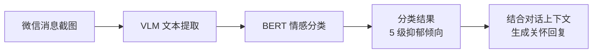

<a name="readme-top"></a>

<div align="center">

<h1>SightFlow Desktop Agent · 情感关怀增强版</h1>

<p><strong>基于 SightFlow 开源项目，增加 BERT 情感分类模块，实现微信消息抑郁倾向识别与情感关怀自动回复。</strong></p>

<p>
  <a href="LICENSE"></a>
  
  
  
</p>

<p>
  <a href="#-原项目说明"><b>原项目说明</b></a> ·
  <a href="#-新增功能情感分类与关怀回复"><b>新增功能</b></a> ·
  <a href="#-快速开始"><b>快速开始</b></a> ·
  <a href="#-情感分类模块详解"><b>模块详解</b></a> ·
  <a href="#-配置说明"><b>配置说明</b></a>
</p>

</div>

---

## 📌 原项目说明

本项目基于 [sightflow-dev/sightflow-desktop-agent](https://github.com/sightflow-dev/sightflow-desktop-agent) 进行二次开发。

SightFlow 是一个开源的桌面端 AI 工作记忆引擎 (Working Memory Engine)，核心能力是 **See · Think · Do · Learn**：

| 阶段 | 说明 |
| :-- | :-- |
| **See** | 视觉模型理解任意软件 UI 及当前状态 |
| **Think** | Agent 结合上下文和历史进行规划决策 |
| **Do** | 模拟人类操作：点击、输入、切换窗口、发送消息 |
| **Learn** | 每次执行写入结构化 work-trace，积累持久工作记忆 |

原项目技术栈：**Electron · electron-vite · React · TypeScript**，由视觉语言模型 (VLM) 驱动。

---

## ✦ 新增功能：情感分类与关怀回复

在原项目"识别微信信息并给出回复"流程中，插入了一个 **BERT 情感分类模块**，实现以下流程：



### 处理流程

| 步骤 | 模块 | 输入 | 输出 |
| :-- | :-- | :-- | :-- |
| 1 | VLM 视觉识别 | 聊天窗口截图 | 对方最新消息文本 |
| 2 | BERT 情感分类 | 文本字符串 | 分类等级（5 级）+ 置信度 |
| 3 | Prompt 拼接 | 分类结果 + 对话上下文 | 增强后的 system prompt |
| 4 | LLM 回复生成 | 增强后的 prompt | 包含情感关怀的回复文本 |

### 分类等级与关怀策略

| 等级 | 类别 | 关怀策略 |
| :-- | :-- | :-- |
| 0 | 无抑郁 | 正常对话回复 |
| 1 | 轻度抑郁 | 温和关怀，鼓励表达 |
| 2 | 中度抑郁 | 主动倾听，提供情感支持 |
| 3 | 重度抑郁 | 深度共情，建议寻求专业帮助 |
| 4 | 极重度抑郁 | 强烈建议就医，提供心理热线信息 |

---

## 🚀 快速开始

### 前置条件

- **Node.js** (LTS 版本)
- **Python 3.8+**（情感分类模块需要）
- **npm**

### 1. 安装依赖

```bash
# 克隆项目
git clone https://github.com/DreDabe/sightflow-desktop-agent.git
cd sightflow-desktop-agent

# 安装 Node.js 依赖
npm install
```

### 2. Python 依赖

首次运行时，程序会 **自动检测并安装** Python 依赖（`torch`, `transformers`, `pandas`, `scikit-learn`, `kagglehub`, `tqdm`, `numpy`）。

如需手动安装：

```bash
pip install -r sentpredict/requirements.txt
```

> 国内用户建议配置 HuggingFace 镜像：程序已内置 `HF_ENDPOINT=https://hf-mirror.com`。

### 3. 运行开发模式

```bash
npm run dev
```

### 4. 构建发布

```bash
npm run build:win     # Windows
```

---

## 🔬 情感分类模块详解

### 目录结构

```
sentpredict/
├── BertModel.py          # BERT 分类模型网络结构
├── classify_server.py    # 推理服务（常驻 Python 子进程）
├── train_server.py       # 训练脚本（由设置界面调用）
├── train.py              # 原始训练脚本（含测试与曲线绘制）
├── predict.py            # 原始预测脚本
├── requirements.txt      # Python 依赖列表
└── models/               # 模型权重目录（已加入 .gitignore）
    └── best.pt           # 训练后的最优权重（需自行训练）
```

### 模型架构

基于 **bert-base-chinese** 的文本分类模型：

```python
BertClassifier(
    bert: BertModel          # bert-base-chinese 预训练权重
    dropout: Dropout(0.5)    # 防过拟合
    linear: Linear(768, 5)   # 5 分类输出
)
```

- **输入**：中文文本（max_length=350）
- **输出**：5 维 logits → softmax → 分类概率

### 推理服务 (classify_server.py)

以 **常驻子进程** 方式运行，通过 stdin/stdout JSON 通信：

```
Node.js ──JSON──▶ Python (classify_server.py)
Node.js ◀──JSON── Python
```

- 启动时加载模型，输出 `{"status": "ready"}`
- 接收 `{"text": "..."}`，返回 `{"classIndex": 0, "className": "无抑郁", "probabilities": [...]}`
- 接收 `"exit"` 关闭进程

### 训练服务 (train_server.py)

从设置界面触发，以子进程方式运行：

- **数据集**：Kaggle 中文抑郁数据集 (`kyharndeok/dpreesion`)，自动下载
- **训练参数**：epoch=7, batch_size=32, lr=1e-5, early_stopping_patience=3
- **输出**：每轮训练进度通过 JSON 事件实时推送到 UI
- **保存**：验证集最优模型保存为 `models/best.pt`

### Node.js 封装 (classifier.ts)

`SentimentClassifier` 类管理 Python 子进程的完整生命周期：

- `start(scriptDir)` — 启动子进程，自动安装依赖，等待模型加载就绪
- `classify(text)` — 发送文本进行分类，10 秒超时保护
- `stop()` — 优雅关闭子进程

`ensurePythonDeps(scriptDir)` — 检测 Python 依赖是否完整，缺失时自动执行 `pip install -r requirements.txt`。

---

## ⚙️ 配置说明

### 基础配置

与原项目一致，需要配置火山方舟 (Volcengine Ark) API Key：

1. 打开 [火山引擎控制台 → 方舟](https://console.volcengine.com/ark)，启用服务并生成 API Key
2. 启动应用后点击右下角设置按钮
3. 在 **基础配置** 中填入 API Key，默认 Base URL `https://ark.cn-beijing.volces.com/api/v3` 通常无需修改
4. 在 **智能体** 中选择启用的 Provider，内置默认为 **豆包 Seed**

### 情感模型训练

在设置界面的 **情感模型训练** 卡片中操作：

1. 点击 **开始训练** — 自动下载数据集并启动训练
2. 训练日志实时显示在下方日志视图中（带时间戳和 TRAIN 标识）
3. 训练完成后模型自动保存为 `sentpredict/models/best.pt`
4. 训练过程中可点击 **停止训练** 中断

> ⚠️ 训练过程耗时较长（数小时），请耐心等待。首次训练需下载 BERT 预训练权重和数据集。

### 目标应用与框选

- **微信** / **企业微信**：默认使用 VLM 自动检测窗口区域
- **钉钉、飞书、Slack、Telegram** 等：需手动框选三个区域（会话列表、聊天内容区、输入框）

---

## 🏗️ 项目架构

```
src/
├── main/
│   └── index.ts              # 主进程：窗口管理、IPC、训练进程管理
├── core/
│   └── sentiment/
│       ├── classifier.ts     # 情感分类器封装（Python 子进程管理）
│       └── types.ts          # 类型定义
├── preload/
│   └── index.ts              # 预加载脚本（IPC Bridge）
└── renderer/
    └── src/
        ├── App.tsx           # 渲染进程：主界面 + 设置界面
        └── index.css         # 全局样式
```

### IPC 通信

| 通道 | 方向 | 说明 |
| :-- | :-- | :-- |
| `train:start` | Renderer → Main | 启动训练 |
| `train:stop` | Renderer → Main | 停止训练 |
| `train:status` | Renderer → Main | 查询训练状态 |
| `train:event` | Main → Renderer | 训练事件推送（进度、完成、错误） |
| `engine:start` | Renderer → Main | 启动引擎 |
| `engine:log` | Main → Renderer | 运行日志推送 |

---

## 📦 模型权重

训练产生的模型权重文件（`*.pt`, `*.pth`, `*.onnx`）体积较大，已通过 `.gitignore` 排除：

```gitignore
sentpredict/models/*.pt
sentpredict/models/*.pth
sentpredict/models/*.onnx
```

如需使用预训练权重，请自行训练或从其他途径获取，放置于 `sentpredict/models/best.pt`。

---

## 🔐 安全与数据

- 工作记忆 (Work Trace) 默认 **本地存储**，不上传任何服务器
- 情感分类在本地 Python 子进程中执行，文本数据不离开本机
- 开源代码 ≠ 开放数据：**你的工作数据始终属于你**

---

## 🤝 致谢

本项目基于以下开源项目进行二次开发：

- **[SightFlow](https://github.com/sightflow-dev/sightflow-desktop-agent)** — 开源桌面端 AI 工作记忆引擎，Apache License 2.0

---

## 📄 许可证

Released under the [Apache License 2.0](LICENSE).

---

<div align="center"><sub>© 2026 Based on SightFlow. Released under the Apache License 2.0.</sub></div>

<p align="right"><a href="#readme-top">↑ Back to top</a></p>
